# Depth Anything V2を用いたUAV稲画像からの高さ推定に向けた予備的検討

## 要旨

本研究の最終目的は、UAVで撮影した稲のRGB画像から、地面と稲冠の幾何を推定し、稲の高さ推定および3D復元へ接続することである。本予備実験では、Depth Anything V2のrelative depthモデルとmetric depthモデルを用い、一般画像、KITTI、ETH3D、公開稲UAV画像、UAV3DCrop、AirMeasurerを段階的に評価した。KITTI 50画像では、全valid pixelのpooled MAE 2.5921 m、RMSE 5.4692 m、AbsRel 0.1282を得た。ETH3Dでは1画像のdisparityからmetric depthを復元し、MAE 1.4367 m、RMSE 1.8926 m、AbsRel 0.2105を得たほか、同一カメラ座標で点群比較を行った。LUMSの稲RGB 9画像では推論と植生・地面候補分離を実行できたが、frame-level ground truthがなく、canopy-ground depth differenceはproxyに限定された。UAV3DCrop 52画像ではraw metric depthにMAE 13.5787 m、Bias -13.5787 mの大きな誤差があり、作物UAV domainにおける絶対スケールの不整合が確認された。一方、local depth differenceでは、32 px pairのGT差分中央値が0.015625 mであり、zero baseline MAE 0.040656 mに対してmetric rawは0.053259 m、relative scale+shiftは0.040874 mであった。この結果は、local MAEだけではgeometry preservationを示せないことを意味する。AirMeasurerのrice orthomosaic 1時期では、LASからCHMを再生成し、DA2 relativeとCHMのPearson 0.2579、Spearman 0.2098を得たが、CHM中央値constant baselineのMAE 0.0563 mをscale+shift後DA2のMAE 0.0791 mは下回らなかった。以上から、Depth Anything V2はUAV作物・稲画像へ適用可能であるが、出力をそのままmetricな稲高と解釈することは困難である。relative geometry、ground plane、camera geometry、外部scale、独立したheight ground truthを組み合わせた検証が必要である。

**キーワード:** Depth Anything V2、monocular depth estimation、UAV、稲、canopy height、relative depth、metric depth、CHM、3D point cloud

## 1. はじめに

稲の草丈や群落高は、生育状態、品種差、施肥・水管理の影響を把握するための重要な形質である。従来は圃場での手測りや、複数地点でのサンプリングが中心であり、広い圃場を高頻度に調査するには人的・時間的コストがかかる。UAVは、圃場を短時間で撮影でき、作物の空間分布を画像として保存できるため、デジタル作物表現型解析に適している。

UAV画像から高さを得る従来の代表的方法は、複数視点画像を用いるphotogrammetryである。Structure-from-Motion（SfM）でカメラ姿勢と疎な3D構造を推定し、Multi-View Stereo（MVS）で複数画像から密な表面を復元する。地面表面と作物表面を分離できれば、Digital Surface Model（DSM）とDigital Elevation Model（DEM）の差としてCanopy Height Model（CHM）を作成できる。しかし、風による葉の移動、遮蔽、反復テクスチャ、地面の不可視化、撮影姿勢や測量基準の不足は、作物の高さ推定を難しくする。

これに対してmonocular depth estimationは、1枚のRGB画像から画素ごとの深度を推定する方法である。複数視点撮影を必要としないため、単一UAVフレームからの推定や、既存画像への後処理に利用できる可能性がある。Depth Anything V2は、大規模な合成・実画像学習に基づく単眼深度推定モデルであり、一般画像に対するrelative depthに加えて、metric depthへfine-tuningされたモデルも公開されている。本研究では、将来のUAV稲RGB画像への応用可能性を調べるため、公式モデルに近いHugging Face実装を用いて、relative depthとmetric depthを明確に分けて検証した。

本予備実験の目的は、Depth Anything V2を利用してUAV RGB画像から稲の高さ推定や3D復元が可能かを判断するため、公開データを用いて基礎的特性を調査することである。特に、絶対的なカメラ距離の正しさと、同一画像内の局所的な深度差・高さ差の保存性能を分離して評価する。

## 2. Depth Anything V2

### 2.1 Monocular depth estimation

単眼深度推定では、入力画像を (I)、推定深度画像を (hat{D}) とすると、モデルは概念的に

\[
\hat{D}=f_\theta(I)
\]

を学習する。各画素に値が出力されるが、その値がメートル単位であるとは限らない。学習データ、モデルの出力定義、後処理によって、relative depthとmetric depthを区別する必要がある。

### 2.2 Relative depthとmetric depth

relative depthは、画像内の前後関係や局所的な形状を表す相対値である。例えば「Aの画素はBより近い」という順序を表現できても、「Aはカメラから5.2 m」とは言えない。出力に任意のscaleとshiftを加えても、同じ相対関係が保たれる場合がある。

metric depthは、学習された距離スケールを持つことを意図した出力であり、本プロジェクトではm単位で扱う。例えば、予測値5.2が5.2 mを意味する。しかしmetric checkpointであっても、学習domainと入力domainが異なれば、global offsetやscale biasが生じ得る。

### 2.3 使用モデル

本研究ではSmallモデルを用いた。relativeモデルは `depth-anything/Depth-Anything-V2-Small-hf`、屋外metricモデルは `depth-anything/Depth-Anything-V2-Metric-Outdoor-Small-hf` である。公式監査で、relativeとmetricは別model IDであり、後者はVirtual KITTI 2でfine-tuningされたmax depth 80 mの屋外モデルであることを確認した。ETH3Dの屋内sceneには `depth-anything/Depth-Anything-V2-Metric-Indoor-Small-hf` を用い、max depth 20 mとした。

Transformers実装ではprocessorの出力をモデルへ入力し、`predicted_depth`を元画像サイズへbicubic補間している。公式metric実装との同一画像比較では、KITTI smoke frameのMAE 0.1712 m、ETH3D画像のMAE 0.1004 m、平均相対差は約0.7 %であり、前処理・補間の差を含む実装差として大きな不整合は見られなかった。KITTI GTはuint16値を256で割り、メートルへ変換した。metricとrelativeの混同、invalid depthの混入、単位不一致は確認されなかった。

## 3. 使用データセット

### 3.1 KITTI

KITTIは車載カメラとレーザスキャナを用いた屋外道路データセットであり、一般的なforward-looking屋外画像に対するmetric depthの基準として利用した。RGB画像と `groundtruth_depth` のuint16 PNGを用い、GTを `GT=raw/256.0` mへ変換した。今回の評価対象は、validation用cropped subsetから選択した50画像である。GTが有限かつ0より大きく、予測も有限かつ0より大きい画素をvalidとし、GT 80 m以下を対象とした。

KITTIを使用した理由は、まずmetric outdoor checkpointが一般的な屋外環境でメートル深度としてどの程度機能するかを確認するためである。道路環境と稲圃場は異なるため、KITTIの良好な結果を稲へ外挿するのではなく、baselineとして扱う。

### 3.2 ETH3D

ETH3Dは屋内外のstereo・multi-view stereo評価用データセットであり、画像、calibration、disparityまたは3D ground truthを提供する。今回は `delivery_area_1l/im0.png` のlow-res two-viewデータを1画像使用した。calibrationの (f_x=541.764) px、baseline (=59.9101) mm、disparity (d)、doffs (=0) から、

\[
Z[m]=\frac{f_x[pixel]B[mm]}{d[pixel]+d_{offs}}\frac{1}{1000}
\]

でカメラ前方Z-depthを復元した。屋内用metric modelで予測し、depthから同一intrinsicsを用いてcolored point cloudを生成した。ETH3Dを使用した理由は、RGB、disparity、calibration、点群を同一のrectified camera座標で扱えるためである。

### 3.3 LUMS rice UAV

LUMS-WITの公開稲UAVデータは、DJI Mini 4 Proで撮影した稲圃場の実画像を含む。early（2025-08-22）、middle（2025-09-12）、late（2025-10-03）から3画像ずつ、計9画像を使用した。dataset documentationには6 mのorthomosaic flight、10 mのDEM flight、13時期の撮影、2区画の情報がある。選択画像のmetric depth中央値は約5.258–6.822 mであり、README記載の約6 mという撮影高度と同程度のオーダーであった。

ただし、公開Git treeで確認できたRGB frameには、frame固有のcamera pose、intrinsics、DEMへの投影対応、実測稲高の対応表がなかった。従って、LUMSでは絶対depthのMAEや稲高精度を評価していない。ExG、VARI、HSVを比較し、VARIをvegetation maskに採用した。ground candidateを保守的に作り、`ground depth - canopy depth` をcanopy-ground depth difference proxyとして記録した。この値は稲高ではない。

### 3.4 UAV3DCrop

UAV3DCropは、複数角度・複数作物のUAV画像に、frame対応のdense photogrammetry depth、camera intrinsics、extrinsicsを付与する公開ベンチマークである。今回は `2025/Day001_Wheat` 20画像、`2025/Day001_Oat` 16画像、`2025/Day007_Corn` 16画像、計52画像を使用した。各sceneでnadir 10または8画像、oblique 10または8画像を選択し、全体ではnadir 26、oblique 26である。

UAV3DCropを使用した理由は、LUMSで不足していたRGBとGT depthのframe-level対応、intrinsics、extrinsicsを同時に評価できるためである。GTはphotogrammetry由来のcamera-frame z-depthであり、手測りの稲高GTではない。RGBとdepthのshapeは一致し、GTの補間は行わなかった。

### 3.5 AirMeasurer

AirMeasurerは稲のmulti-season aerial phenotypingを対象とするソフトウェア・データである。公式releaseの全testing dataはorthomosaic 8個とpoint cloud 8個、約11.3 GBである。今回は必要最小限のsmall-field archiveから `20220505.tif` と `20220505.las` を取得した。orthomosaicは3676×3749、4 band、EPSG:32650、GSD 0.00257 mであり、LASは1,190,990点である。RTK shapefileにはPointZ control pointが4点あるが、plot polygonやheight tableではない。

LASへSORとCSFを適用し、ground pointからDEM、上部表面からDSMを近似的に作成し、

\[
CHM=DSM-DEM
\]

を計算した。CHMをGeoTIFFのCRS・extent・transformに基づいてorthomosaic格子へ再投影した。AirMeasurerのRGBは複数画像から再構成されたorthomosaicであり、単一pinhole camera imageではない。従って、AirMeasurerでmetric DA2をcamera-frame depthとして評価せず、relative outputとCHM heightの探索的なgeometry比較を行った。

## 4. 評価方法

### 4.1 Absolute depth指標

valid pixel集合を (V)、予測を (hat{d}_i)、GTを (d_i) とする。MAE、RMSE、AbsRel、Biasは次式で定義した。

\[
MAE=\frac{1}{|V|}\sum_{i\in V}|\hat{d}_i-d_i|
\]

\[
RMSE=\sqrt{\frac{1}{|V|}\sum_{i\in V}(\hat{d}_i-d_i)^2}
\]

\[
AbsRel=\frac{1}{|V|}\sum_{i\in V}\frac{|\hat{d}_i-d_i|}{d_i}
\]

\[
Bias=\frac{1}{|V|}\sum_{i\in V}(\hat{d}_i-d_i)
\]

MAEは平均的な絶対誤差、RMSEは大きな誤差をより強く評価し、AbsRelはGT距離に対する相対的な誤差、Biasは予測が系統的に近すぎるか遠すぎるかを表す。KITTI、ETH3D、UAV3DCropでは、datasetが定義するGT単位とvalid maskを尊重した。

### 4.2 Relative geometry指標

相関は、値が一緒に増減するかを調べる指標である。Pearson correlationは線形な共変動、Spearman correlationは順位の共変動を表す。絶対scaleやoffsetが合わない場合でも、相関が高ければ形状順序の一致を示す可能性がある。ただし相関が高いことは、絶対値や変化量が正しいことを意味しない。

局所pixel pair (p_1,p_2)について、

\[
\Delta d_{GT}=d_{GT}(p_1)-d_{GT}(p_2)
\]

\[
\Delta d_{pred}=d_{pred}(p_1)-d_{pred}(p_2)
\]

と定義した。Local Difference MAEは、

\[
LD\text{-}MAE=\frac{1}{N}\sum_{j=1}^{N}|\Delta d_{pred,j}-\Delta d_{GT,j}|
\]

である。sign agreementは、

\[
sign(\Delta d_{pred})=sign(\Delta d_{GT})
\]

となる割合であり、どちらの画素が近いかという順序の一致を表す。

pixel pairは水平・垂直方向からseparation 8、16、32、64、128 pxをサンプリングし、同じpair集合をvariant間で再利用した。GT invalid pixelを除外し、重複samplingを避けた。UAV3DCropのrelative出力は、公式のinverse-depth orientationを確認した上で、GT z-depthとのscale+shift診断では向きを合わせるためにnegateしてから整合した。AirMeasurerではtop-down CHM高との探索的比較として、near-largeの正方向をcanopy-highness proxyとしてそのまま使用した。

### 4.3 Zero baselineとscale+shift

zero baselineは、すべてのlocal depth differenceを0と予測する単純モデルである。GT差分の大部分が0に近い場合、このbaselineだけでもMAEが小さくなる。そのため、DA2のlocal MAEがzero baselineを改善するかを確認した。

scale+shift alignmentでは、GTを使って

\[
\hat{d}_{aligned}=a\hat{d}+b
\]

の (a,b) を最小二乗で求める。これはgeometry preservationを診断するための処理であり、同じGTで校正・評価した値をuncalibrated single-image inferenceの精度として扱ってはならない。

## 5. KITTI実験

50画像の全valid pixelをpooledした最終結果を表1に示す。

| 指標 | pooled | 画像平均 | 画像中央値 |
|---|---:|---:|---:|
| MAE [m] | 2.5921 | 2.6643 | 2.5104 |
| RMSE [m] | 5.4692 | 5.2404 | 5.0440 |
| AbsRel | 0.1282 | 0.1305 | 0.1233 |
| SqRel | 0.8571 | 0.9000 | 0.7663 |
| RMSE log | 0.2172 | 0.2064 | 0.1885 |
| δ<1.25 | 0.8058 | 0.8039 | 0.8336 |

GT距離帯別の結果を表2に示す。

| GT距離帯 | valid pixels | MAE [m] | RMSE [m] | AbsRel |
|---|---:|---:|---:|---:|
| 0–10 m | 1,463,249 | 0.7002 | 1.2224 | 0.0904 |
| 10–20 m | 1,388,449 | 1.7930 | 2.7908 | 0.1273 |
| 20–40 m | 598,059 | 4.7977 | 6.5368 | 0.1707 |
| 40–60 m | 150,994 | 13.7114 | 16.5754 | 0.2780 |
| 60–80 m | 50,104 | 20.1499 | 24.1263 | 0.2982 |

近距離ではMAE 0.7002 mであるのに対し、60–80 mでは20.1499 mとなった。距離が増えるほど誤差とAbsRelが増加し、delta指標も低下する傾向が確認された。KITTIではモデルが機能したが、これは屋外道路domainとmetric outdoor checkpointの関係に依存する。図1と図2に散布図、距離帯別誤差、代表例を示す。

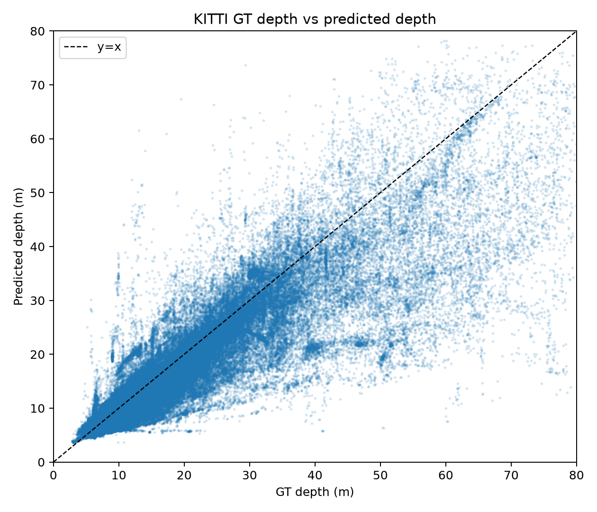

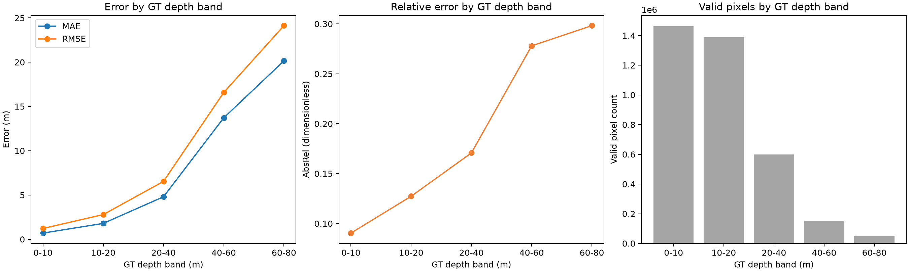

## 6. ETH3D実験

ETH3D `delivery_area_1l/im0.png` では、GT disparityとcalibrationからmetric Z-depthを復元した。屋内metric modelを使用した結果を表3に示す。

| 指標 | 値 |
|---|---:|
| valid pixels | 343,531 |
| MAE [m] | 1.4367 |
| RMSE [m] | 1.8926 |
| AbsRel | 0.2105 |
| SqRel | 0.3769 |
| RMSE log | 0.2595 |
| δ<1.25 | 0.5700 |

予測depthとGT depthを同一画像の同一pixelから点群へ変換した。intrinsicsはETH3D calibrationを使用し、rigid transformation、ICP、scale alignmentは適用していない。点群の双方向nearest-neighbor比較を表4に示す。

| 指標 | 値 [m] |
|---|---:|
| predicted → GT mean | 0.6751 |
| GT → predicted mean | 1.1517 |
| symmetric Chamfer-like mean | 0.9134 |
| nearest-neighbor median | 0.3604 |
| nearest-neighbor 95 percentile | 3.5264 |

ETH3Dの結果は、disparityからmetric depthを作り、点群へ変換するコード経路が動作したことを示す。しかし評価は1画像中心であり、sceneは屋内である。またlow-res two-view GTはstereo評価用であり、稲冠の表面精度を表すものではない。従って、ETH3Dの数値をUAV作物へ一般化しない。

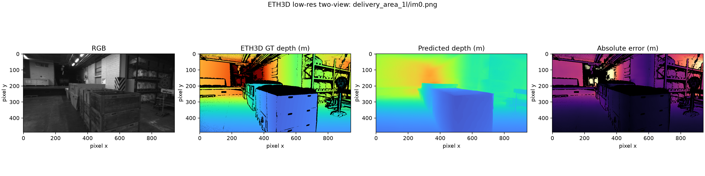

Figure 4で用いたETH3D点群は、[予測点群im0_pred.ply](../outputs/eth3d_gt/im0_pred.ply)および[GT点群im0_gt.ply](../outputs/eth3d_gt/im0_gt.ply)である。

## 7. LUMS rice UAV実験

LUMSの9画像では、relative depthとmetric outdoor depthを生成し、VARIによるvegetation maskとappearance-based ground candidateを作成した。metric depthの画像ごとの中央値は約5.2579–6.8221 mであり、READMEの約6 m flight altitudeと同程度のオーダーであった。しかしGPS altitudeは海抜相当の記録であり、frame固有のAGLではない。したがって、この一致は精度確認ではない。

earlyのcanopy-ground depth difference median proxyは、3画像で0.0955、-0.0641、0.0482 mであった。middleでは1.1585、1.6496、-0.4297 mであり、画像間のばらつきが大きかった。lateの3画像は、黄化・褐色化した葉がvegetation maskから漏れ、候補pixelがgroundでない可能性が高かったため、`NO_GROUND_REFERENCE`とし差分を数値化しなかった。

この値を稲高と呼ぶことはできない。raw frameとDEM、manual height、camera poseの対応がなく、ground candidateが同一地面平面である保証もないためである。LUMSでは、実際の稲画像へDA2を適用でき、失敗要因を観察できたことが成果であり、精度評価は次のUAV3DCropとAirMeasurerへ持ち越した。

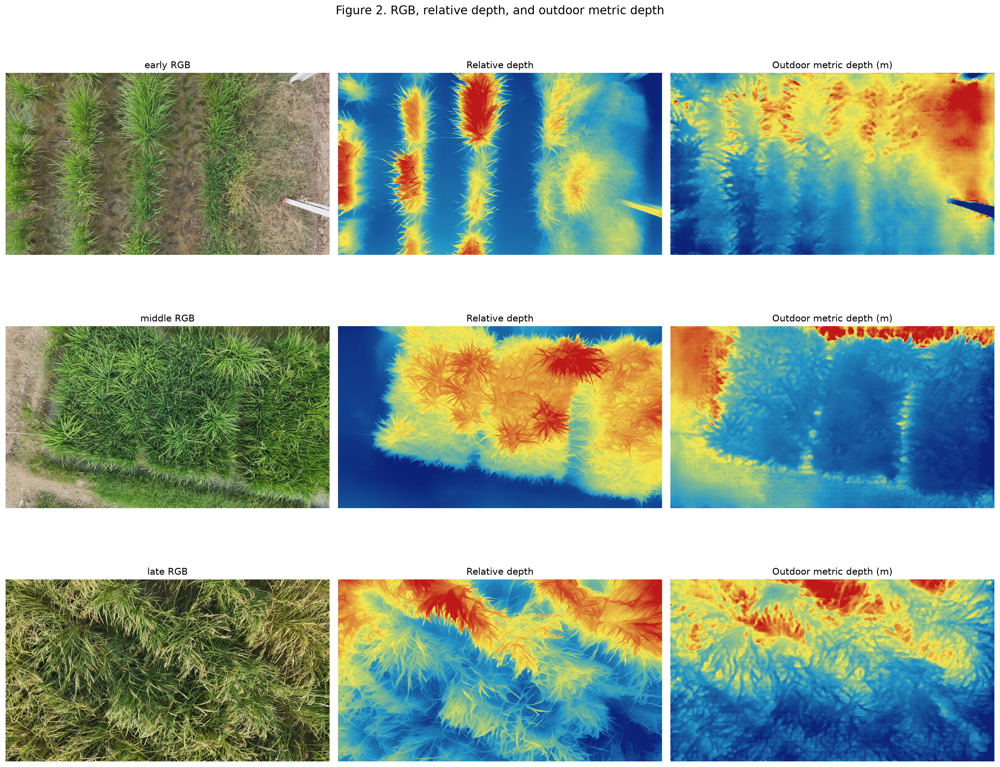

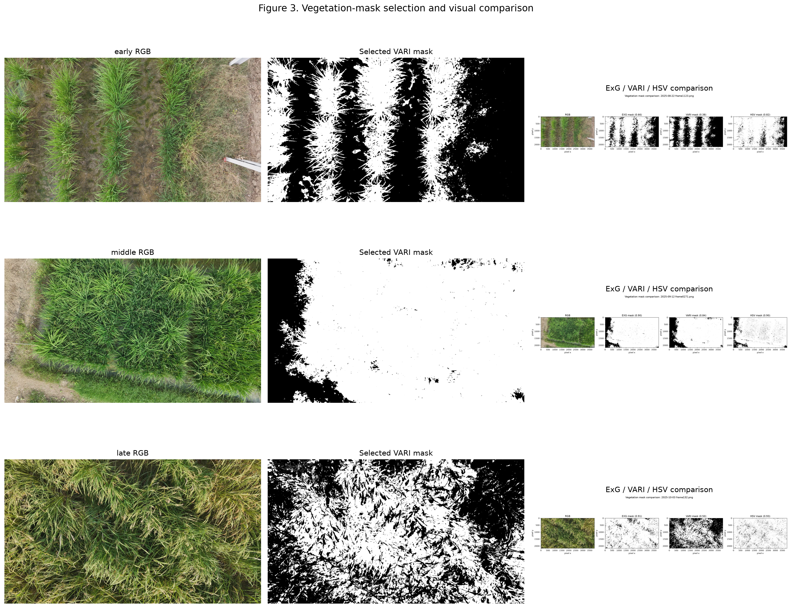

## 8. UAV3DCrop absolute depth実験

UAV3DCropの52画像に対して、同一raster上のMVS z-depthをGTとしてmetric outdoor modelを評価した。全体のpooled結果は表5の通りである。

| 指標 | pooled | 画像平均 |
|---|---:|---:|
| MAE [m] | 13.5787 | 13.5865 |
| RMSE [m] | 14.7136 | 14.1022 |
| AbsRel | 0.6570 | 0.6570 |
| Bias [m] | -13.5787 | -13.5865 |

raw metric predictionのBiasがほぼMAEと同じ負値であり、予測がGTより一貫して小さいことが分かる。これは、metric outdoor checkpointが学習した道路・一般屋外の距離分布と、UAV crop imageryの視点・canopy・撮影条件のdomain shiftによる大きなglobal biasと解釈できる。ただし、これだけでDepth Anything V2がUAV全般で使用不能とは一般化しない。nadir 10画像のMAEは9.4131 m、oblique 10画像は16.5767 mで、obliqueが悪い傾向であったが、view構成とscene分布が混在する予備結果である。

global bias correction後やscale+shift alignment後には誤差が小さくなるが、これらはGTを使った診断値であり、raw metric精度ではない。metric raw、bias corrected、scale+shift、relative alignedを別指標として保持した。

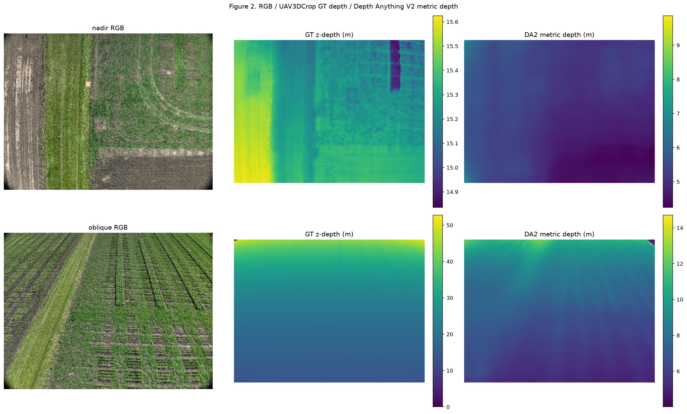

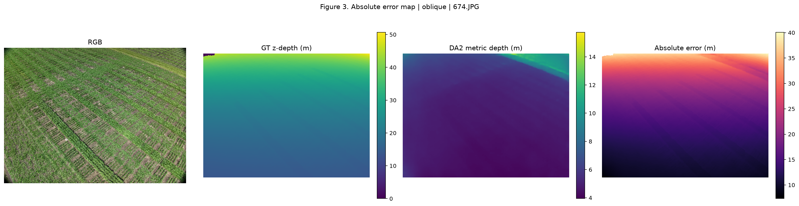

## 9. UAV3DCrop local geometry実験

UAV3DCropでlocal geometryを評価した理由は、absolute depthに大きなoffsetがあっても、植物表面の差分を保存する可能性があるためである。52画像、32 px pairのGT (|\Delta d|) 分布では、平均0.040656 m、中央値0.015625 m、標準偏差0.131434 m、95 percentile 0.15625 mであった。

表6に32 pxの主結果を示す。

| variant | Local Difference MAE [m] | RMSE [m] | Pearson | sign agreement |
|---|---:|---:|---:|---:|
| zero baseline | 0.040656 | 0.137579 | 0.0000（定義上） | 0 |
| metric raw | 0.053259 | 0.150960 | 0.1023 | 0.5256 |
| relative scale+shift | 0.040874 | 0.135551 | 0.2894 | 0.5621 |

metric rawはzero baselineよりMAEが悪く、relative alignedもzero baselineをわずかにしか改善しなかった。したがって、Local Difference MAEが4–5 cmだから、4–5 cm精度で高さ推定できるという解釈は誤りである。GT差分の中央値自体が1.5625 cmであり、多くのpairは差分がほぼ0である。常に0を予測してもMAEが小さくなるため、相関、sign agreement、slope、GT差分分布を同時に見る必要がある。

separation 128 pxではmetric raw MAE 0.1193 m、Pearson 0.1722、sign 0.5457、relative aligned MAE 0.0836 m、Pearson 0.3912、sign 0.5834であった。pixel separationが増えるとrelativeの相関と順序一致は上がるが、差分誤差も増える。

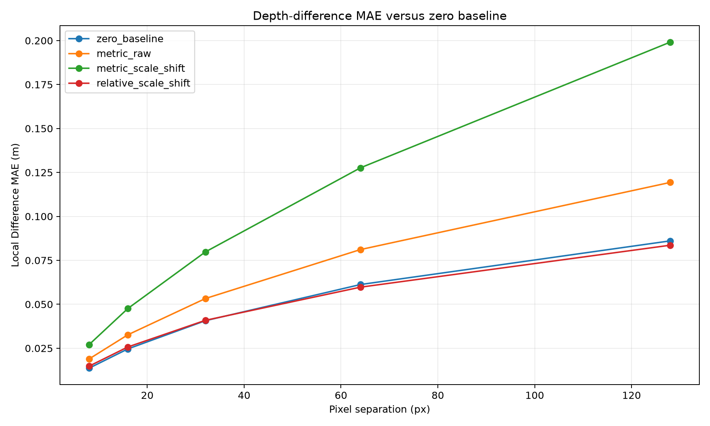

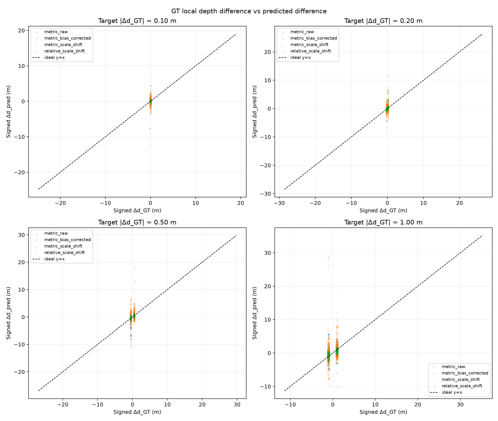

## 10. Difference magnitude別評価

GT差分の絶対値について、目標値の±20 %範囲に入るpairを抽出した。表7はmetric rawとrelative scale+shiftの比較である。

| GT差分target | variant | pairs | MAE [m] | Pearson | sign agreement | slope |
|---:|---|---:|---:|---:|---:|---:|
| 0.1 m | metric raw | 155,755 | 0.1147 | 0.0731 | 0.5740 | 0.1220 |
| 0.1 m | relative aligned | 155,755 | 0.0922 | 0.2234 | 0.6520 | 0.1779 |
| 0.2 m | metric raw | 98,111 | 0.2048 | 0.1223 | 0.6265 | 0.1551 |
| 0.2 m | relative aligned | 98,111 | 0.1755 | 0.3546 | 0.7357 | 0.2110 |
| 0.5 m | metric raw | 55,071 | 0.4657 | 0.1540 | 0.6481 | 0.1071 |
| 0.5 m | relative aligned | 55,071 | 0.3720 | 0.5458 | 0.8369 | 0.3064 |
| 1.0 m | metric raw | 12,353 | 0.9000 | 0.2183 | 0.6689 | 0.1077 |
| 1.0 m | relative aligned | 12,353 | 0.7516 | 0.5811 | 0.8829 | 0.2491 |

relative alignedはmetric rawよりPearsonとsign agreementが高く、local orderingを部分的に保存する傾向を示した。しかしslopeは全て1を大きく下回る。これは、「どちらが高いか」の方向はある程度合っても、「どれだけ高いか」という差分振幅を強く圧縮していることを意味する。したがって、relative modelのgeometry preservationも完全ではなく、既知height calibrationを別時期・未使用plotで検証する必要がある。

## 11. AirMeasurer rice実験

公式AirMeasurerのpoint cloud処理方針を確認し、SOR、CSF、ground/aboveground分離、DSM/DEM、CHM、H90/H95の考え方を整理した。ただし今回の実装は、Open3D SOR、Python CSF、0.02 m gridのNumPy rasterization、nearest fill、rasterioによるorthomosaic格子への再投影であり、WhiteboxTools TIN、GCP terrain correction、公式plot mask、H90/H95集計を完全には再現していない。

20220505のpoint cloudから、入力1,190,990点、SOR後1,131,782点、CSF ground 832,975点を得た。全CHMの範囲は約0–1.285 mであり、評価sampleの中央値0.0065 m、平均0.0586 m、95 percentile 0.4028 mであった。CHMは単純resizeではなく、EPSG:32650の地理変換を使ってorthomosaic格子へ合わせた。

## 12. AirMeasurer pixel-level結果

AirMeasurerではrelative modelのみを主要評価した。orthomosaicは単一camera frameでないため、metric modelをcamera-frame metric depthとして評価していない。1024×1024 tile、overlap 128で推論し、tile出力を重み付き合成した。CHM-validかつ非黒RGBのvalid pixelは4,958,593、相関計算sampleは300,000であった。

| 指標 | DA2 relative raw / aligned | constant CHM median |
|---|---:|---:|
| Pearson | 0.2579 | — |
| Spearman | 0.2098 | — |
| MAE [m] | 0.0791 | 0.0563 |
| RMSE [m] | 0.1450 | 0.1588 |
| R² | 0.0665 | -0.1206 |

scale+shift後のDA2はRMSEではconstant baselineを下回ったが、MAEでは下回らなかった。相関も弱く、pixel-level canopy height prediction性能が確認されたとは結論できない。ここでのMAEはCHMを使って校正した診断値である。

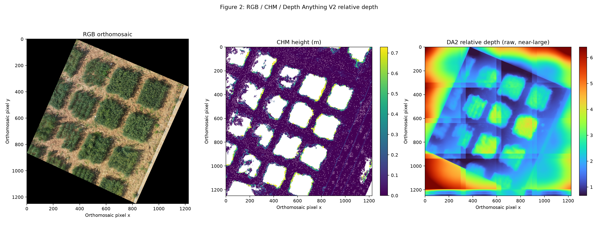

## 13. AirMeasurer local height difference

AirMeasurerではcamera z-depthではなく、CHMのcanopy height差を評価した。GT差分target別の結果を表8に示す。

| GT差分target | pairs | MAE [m] | Pearson | sign agreement | slope |
|---:|---:|---:|---:|---:|---:|
| 0.1 m（0.08–0.12） | 9,664 | 0.0890 | 0.3852 | 0.6834 | 0.0985 |
| 0.2 m（0.16–0.24） | 9,019 | 0.1827 | 0.4826 | 0.7411 | 0.0698 |
| 0.5 m（0.4–0.6） | 6,155 | 0.4637 | 0.6956 | 0.8881 | 0.0554 |
| 1.0 m（0.8–1.2） | 1,246 | 0.8301 | 0.8241 | 0.9615 | 0.0536 |

GT差分が大きくなるとsign agreementとcorrelationは向上したが、slopeは約0.05–0.10に留まった。従って、差分の方向は一部保存されても、差分振幅は著しく圧縮されたと考えられる。ただし1時期・1small-field・簡略CHMであり、稲一般の性質とは言えない。

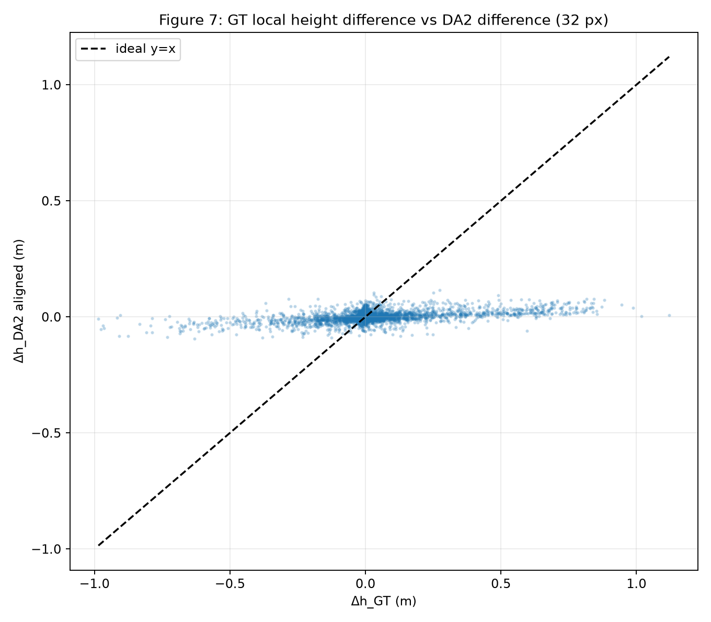

## 14. 総合考察

### 14.1 Absolute metric depth

KITTIでは、特に10 m未満でMAE 0.7002 mとなり、屋外metricモデルが一般道路画像上で有効な出力を得た。一方、UAV3DCropではMAE 13.5787 m、Bias -13.5787 mであり、UAV crop domainで絶対スケールが大きく崩れた。入力視点、canopyの反復構造、距離分布、学習domainとの差が原因候補である。ETH3D indoorでは別の屋内モデルを使用しており、dataset間の数値を単純に優劣比較できない。

### 14.2 Relative geometry

UAV3DCropではrelative alignedがmetric rawよりlocal correlationとsign agreementで良い傾向を示した。しかしzero baselineを明確に大きく改善せず、slopeは1未満であった。したがってrelative outputは、絶対距離より相対順序を調べる中間表現としては有望だが、差分振幅をそのまま植物高に変換できる証拠ではない。

### 14.3 Rice canopy height

AirMeasurerでは、rice orthomosaicとCHMを比較できる形式を構築したが、pixel-level correlationは弱く、constant baselineをMAEで明確に上回れなかった。大きなheight differenceではsign agreementが高くなる傾向があったものの、slopeが小さく差分の圧縮が著しい。CHM側のMVS誤差、orthomosaic stitching、plot/ground mask不足、DA2のdomain mismatchを分離できていない。

### 14.4 Depth Anything V2単体の限界

現時点では、DA2出力値をそのままmetric rice heightとして使用することは困難である。Depth Anything V2のmetric checkpointはメートル出力を意図しているが、実際の精度は入力domainに依存する。またrelative outputはmeterではなく、scale+shift診断値をuncalibrated推論の精度とみなせない。

### 14.5 今後の可能性

今後は、camera intrinsics、camera pose、AGL、ground plane、DEM、CHM、known height calibrationを組み合わせる必要がある。raw frameであれば、camera rayとground planeの交点から地面基準を定義できる。relative depthは外部scale anchorで高さへ変換し、plot-level aggregation、時期をまたぐcalibration、photogrammetryとの融合を検証する価値がある。orthomosaicでは、DA2をcamera-frame depthと呼ばず、画像特徴や局所orderingの補助情報として扱うのが妥当である。

## 15. 本予備実験の限界

第一に、dataset・scene・image数が限られている。KITTIは50画像、ETH3Dは1画像、LUMSは9画像、UAV3DCropは52画像、AirMeasurerは1時期1orthomosaicである。特にAirMeasurerは複数時期の比較、plot-level calibration、held-out plot評価を実施できなかった。

第二に、LUMSではmanual rice heightとの直接比較がなく、canopy-ground proxyを稲高と呼べない。AirMeasurerでもplot boundaryとheight tableがなく、CHMは公式AirMeasurer pipelineの完全再現ではない。

第三に、UAV3DCropのGTはphotogrammetry MVS z-depthであり、植物の真の高さや地面からの高さではない。細い葉、風、反復テクスチャ、遮蔽によりreference側にも誤差が含まれ得る。

第四に、AirMeasurerはorthomosaicであり、raw frameとcamera poseを持たない。これを通常のcamera imageと同じように扱えない。第五に、モデルサイズはSmallのみで、Largeやdomain-specific fine-tuningの比較はしていない。第六に、scale+shift alignmentはGT依存である。第七に、scene数が少なく、統計的有意差検定や一般化性能の検証は行っていない。

## 16. 結論

本予備実験で確認できたことは次の通りである。

1. Depth Anything V2は、一般画像、道路画像、屋内画像、UAV crop画像、公開稲画像へ適用できる。
2. KITTIでは屋外metric depthが有効に機能したが、距離とともに誤差が増加した。
3. UAV3DCropではraw metric depthに大きな負Biasが生じ、UAV作物domainで絶対スケールが崩れた。
4. local MAEだけではgeometry accuracyを判断できず、zero baseline、correlation、sign agreement、slopeが必要である。
5. relative modelはmetric rawより局所orderingを部分的に保持する傾向を示したが、difference amplitudeを強く圧縮した。
6. LUMSでは稲画像への適用はできたが、GT不足のため精度は評価できなかった。
7. AirMeasurerではrice CHMを生成しrelativeと比較できたが、pixel-level相関は弱く、constant baselineをMAEで上回らなかった。
8. 大きなheight differenceではsign agreementが向上したが、これは稲高の絶対精度を意味しない。
9. 稲高推定には、raw frame、camera geometry、ground reference、外部scale、plot-levelまたはmanual height GTが必要である。

従って、現時点の結論は「Depth Anything V2を稲高推定へそのまま適用できた」ではなく、「relative geometryと外部geometry/calibrationを組み合わせる研究仮説を、公開データで具体化できた」である。

## 17. 引用・参考文献

1. Lihe Yang, Bingyi Kang, Zilong Huang, Zhen Zhao, Xiaogang Xu, Jiashi Feng, and Hengshuang Zhao. “Depth Anything V2.” NeurIPS 2024. arXiv:2406.09414. [公式GitHub](https://github.com/DepthAnything/Depth-Anything-V2), [論文](https://arxiv.org/abs/2406.09414).
2. Andreas Geiger, Philip Lenz, and Raquel Urtasun. “Are we ready for Autonomous Driving? The KITTI Vision Benchmark Suite.” CVPR 2012. [公式KITTI](https://www.cvlibs.net/datasets/kitti/).
3. Thomas Schöps, Johannes L. Schönberger, Silvano Galliani, Torsten Sattler, Konrad Schindler, Marc Pollefeys, and Andreas Geiger. “A Multi-View Stereo Benchmark with High-Resolution Images and Multi-Camera Videos.” CVPR 2017. [論文PDF](https://eth3d.ethz.ch/data/schoeps2017cvpr.pdf), [ETH3D](https://www.eth3d.net/).
4. Chaudhry, M. H. H., Rana, M. I., and Jaleel, H. “Infrastructure-Free UAV Phenotyping Dataset.” 公開GitHub dataset repository. [LUMS-WIT repository](https://github.com/LUMS-WIT/infrastructure-free-uav-phenotyping).
5. Junxiong Zhou, Xuechen Li, Chonghao Qiu, Lang Qiao, Xiaowei Jia, Qi Yang, Chishan Zhang, Leikun Yin, Nanshan You, Vipin Kumar, David Mulla, Ce Yang, Zhenong Jin, and Licheng Liu. “UAV3DCrop: Benchmarking 3D Reconstruction in Repeated Multi-Angle UAV Crop Surveys.” arXiv:2608.06404, 2026. [公式project page](https://link-dev.github.io/UAV3DCrop/), [論文](https://arxiv.org/abs/2608.06404).
6. Gang Sun, Hengyun Lu, Yan Zhao, Ji Zhou, R. Jackson, Y. Wang, L.-x. Xu, A. Wang, J. Colmer, E. Ober, Q. Zhao, B. Han, and J. Zhou. “AirMeasurer: open-source software to quantify static and dynamic traits derived from multiseason aerial phenotyping to empower genetic mapping studies in rice.” New Phytologist, 236, 1584–1604, 2022. DOI:10.1111/nph.18314. [Wiley](https://doi.org/10.1111/nph.18314), [公式release](https://github.com/The-Zhou-Lab/UAV/releases/tag/V2.0.2).

## 18. 本文で参照した図表ファイル

数値の根拠は `docs/preliminary_study_source_check.md` に整理した。主要図は次の通りである。

- KITTI: `../outputs/kitti/plots/gt_vs_pred_scatter.png`, `../outputs/kitti/plots/error_by_depth.png`
- ETH3D: `../outputs/eth3d_gt/im0_depth_comparison.png`
- LUMS: `../outputs/rice_uav/report_figures/figure_2_rgb_relative_metric.png`, `figure_7_failure_case.png`
- UAV3DCrop: `../outputs/uav3dcrop/report_figures/figure_2_rgb_gt_pred.png`, `../outputs/uav3dcrop/all_local_analysis/report_figures/figure_4_zero_baseline_comparison.png`, `figure_3_gt_vs_pred_difference_scatter.png`
- AirMeasurer: `../outputs/airmeasurer/report_figures/figure_2_rgb_chm_relative.png`, `figure_7_local_height_difference.png`, `figure_10_local_height_difference_magnitude.png`
